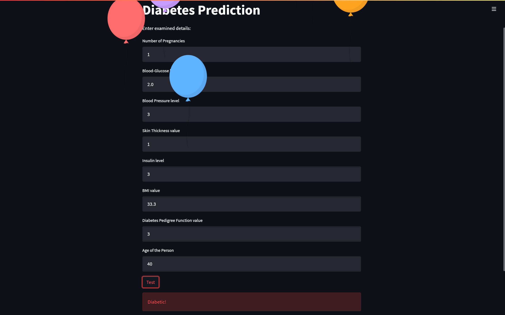

# Diabetes Prediction
> A webpage built using Support Vector Machine algorithm and Streamlit.

### Check it out [here](https://diabetespredictionvilashegde.streamlit.app/)
## Things that I have used
- Supervised machine learning algorithm (SVM)
- Numpy
- Pandas
- Pickle
- Streamlit





## How did I do?
The dataset used from [Kaggle](https://www.kaggle.com/datasets/mathchi/diabetes-data-set)

1. Loaded the .csv file using pandas
2. Checked the outcome column to understand count for 0 and 1
    - 0 -> Non Diabetic
    - 1 -> Diabetic
3. Grouped outcome column based on its mean value with all columns
4. Took 2 variables
    - x -> Columns except **Outcome**
    - y -> **Outcome** column only
5. Standardising data for transform data such that its distribution will have a mean value 0 and standard deviation of 1
```
scalar = StandardScaler()
scalar.fit(x)
standardized_data = scalar.transform(x)
```
6. Splitted the data into Training and Testing purpose
```
x_train,x_test,y_train,y_test = train_test_split(x,y,test_size=0.2,stratify=y,random_state=2 )
```
> 20% is kept for *testing* 
> 
> *stratify* used to ensure that both the train and test sets have the proportion of examples in each class that is present in the provided “y” array

7. Training the SVM model

```
classifier = svm.SVC(kernel='linear')
classifier.fit(x_train,y_train)
```

8. Finding the accuracy score of the model
    * Booyah got **72.2%** accuracy :partying_face:
9. Doing the ultimate part. The **Prediction**
```
input_data = (4,170,92,30,40,37.6,0.592,30)
input_data_as_numpy_array = np.asarray(input_data)

input_data_reshaped = input_data_as_numpy_array.reshape(1,-1)

std_data = scalar.transform(input_data_reshaped)
print(std_data)

prediction = classifier.predict(std_data)
print(prediction)

if (prediction[0]==0):
  print('Not diabetic')
else:
  print('Diabetic!')  
  ```
10. And for user convenience made onto Webpage using [Streamlit](https://streamlit.io/)  
    - Saved our model into .sav file
    - and then took inputs from streamlit input fields
    - Finally prediction is done on the basis of user entered data
